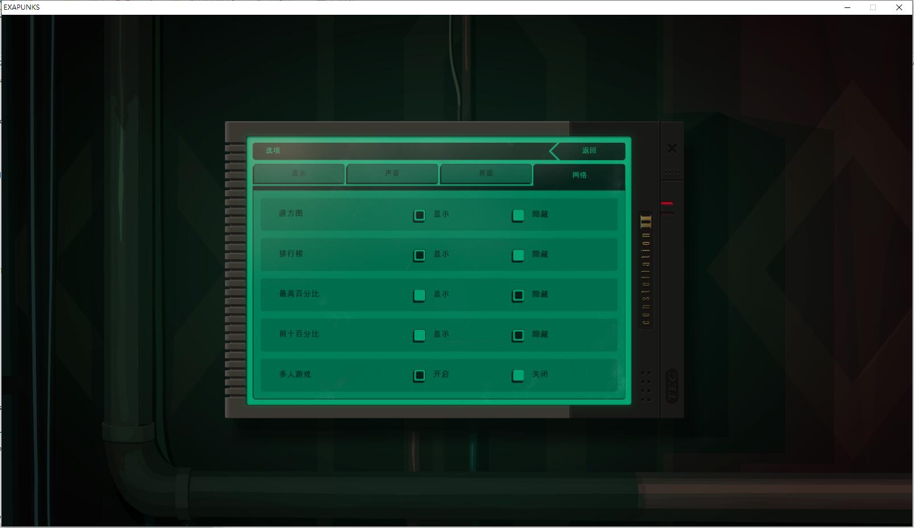
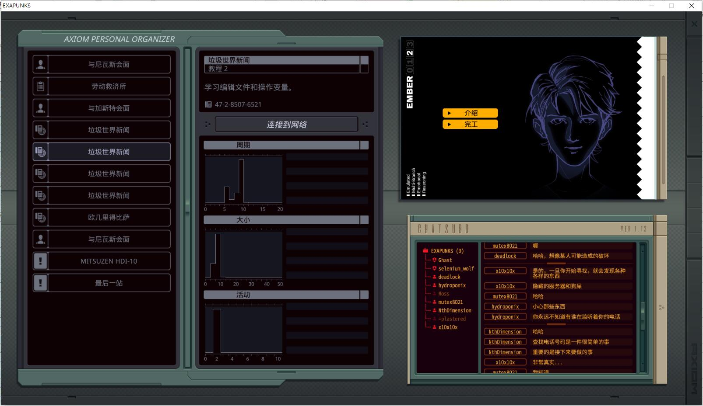

这是一个非官方的游戏汉化项目，游戏名称是EXAPUNKS。

首先，你需要拥有这个游戏。你可以在 [steam](https://store.steampowered.com/app/716490/EXAPUNKS/) 或 [GOG](https://www.gog.com/game/exapunks) 购买好此游戏。

# 准备环境
## 1. 安装 [python](https://www.python.org/) 3 及相关依赖库

* 安装 python [https://www.python.org/downloads/](https://www.python.org/downloads/)

* 安装 [pandas](https://pandas.pydata.org/)

    ```
    pip install pandas
    ```
* 安装 [openpyxl](https://openpyxl.readthedocs.io/en/stable/)
    ```
    pip install openpyxl
    ```

* 安装 [Pillow](https://python-pillow.org/)
    ```
    pip install pillow
    ```

* 安装 [python-lz4](https://github.com/python-lz4/python-lz4)
    ```
    pip install lz4
    ```

## 3. 安装字体
* 安装 [文泉驿微米黑](https://sourceforge.net/projects/wqy/files/wqy-microhei/0.2.0-beta/)
* 安装 [Noto Sans Mono CJK](https://www.google.com/get/noto/help/cjk/)
  
## 2. 复制游戏文件到汉化工作目录

* 复制 ``Content/descriptions/en/*`` 到 ``./export_txt/Content/descriptions/en/``
* 复制 ``Content/vignettes/*`` 到 ``./export_txt/Content/vignettes``
* 复制 ``PackedContent/fonts/*.packedfont`` 到 ``./font/fonts``
* 复制 ``PackedContent/*.tex`` 到 ``./images/PackedContent``

``Content\vignettes\nivas-3.csv`` 第九行少了个双引号, 自己加一下。

# 翻译文本
在import_txt目录下有 3 个json文件需要翻译。

你可以运行``json2excel.py`` 从 json 文件生成 excel 文件，然后在 M$ Excel 或 LibreOffice calc 或随便哪个电子表格编辑器中进行编辑翻译。

* ``EXAPUNKS_descriptions.json``

    抓取自 Content/descriptions/*.txt

    此文件中的所有文本都需要翻译。

* ``EXAPUNKS_vignettes.json``

    抓取自 Content/vignettes/*.csv

    此文件中的所有文本都需要翻译。

* ``EXAPUNKS_exe.json``

    抓取自 EXAPUNKS.exe

    **不是**所有的文本都需要翻译。
    
    仅仅翻译你在游戏中实际看到的文本。

## 如何使用 json2excel.py
从 EXAPUNKS_descriptions.json 生成 EXAPUNKS_descriptions.xlsx
```
json2excel.py EXAPUNKS_descriptions.json EXAPUNKS_descriptions.xlsx
```
做和上面一样的事
```
json2excel.py EXAPUNKS_descriptions.json
```
遍历当前目录，从所有的 .json 文件中生成 .xlsx。
```
json2excel.py
```  


# 修改图片
运行 ``images/export_imgs.py`` 

这会遍历 ``PackedContent`` 目录, 把.tex转换成.png，并输出到 ``out`` 目录。

挑选你需要修改的图片。把它们放在 ``new`` 目录下，注意保持同样的目录结构。(不需要改 ``half`` 下面的图片，我们会自动生成它们。)

# 生成汉化补丁
运行 ``run.bat``，汉化补丁会在 ``patch`` 目录下生成。

如果你想了解此过程的详细情况，请看[details.zh.md](details.zh.md)

# 修改游戏设置
编辑 ``%USERPROFILE%\Documents\My Games\EXAPUNKS\xxxxxx\config.cfg``
```
Language = English
```
把 'English' 改成 'Chinese'

# 汉化截图





